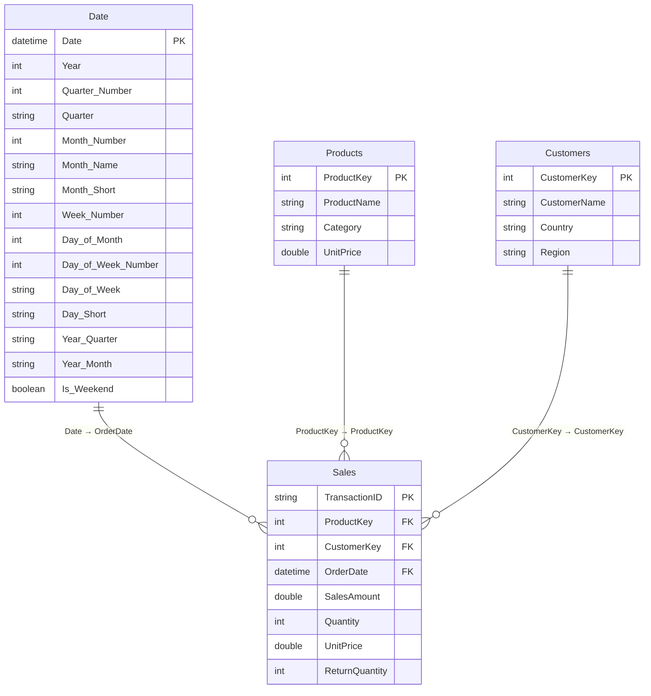

# Project Build — Power BI Semantic Model Documentation

**Version:** 1.0  
**Last Updated:** June 23, 2026  
**Model:** Project Build.pbix  
**Prepared for:** Stakeholder Distribution  

---

## Table of Contents

1. [Executive Summary](#1-executive-summary)
2. [Model Architecture](#2-model-architecture)
3. [Table Relationships Diagram](#3-table-relationships-diagram)
4. [Data Dictionary — Tables & Columns](#4-data-dictionary--tables--columns)
5. [Data Dictionary — Measures](#5-data-dictionary--measures)
6. [Business Logic Explanations](#6-business-logic-explanations)
7. [Usage Guidelines & Best Practices](#7-usage-guidelines--best-practices)
8. [Appendix — DAX Reference](#8-appendix--dax-reference)

---

## 1. Executive Summary

The **Project Build** semantic model is a self-contained Power BI data model designed to support sales performance analysis, customer behaviour insights, and product revenue reporting. It provides a single, governed source of truth for business metrics, enabling consistent reporting across all dashboards and ad-hoc analysis built on top of this model.

### Key Capabilities

| Capability | Description |
|---|---|
| **Sales Performance** | Total revenue, month-to-date, and year-to-date tracking |
| **Time Intelligence** | Period-over-period comparisons against prior month and prior year |
| **Customer Analytics** | Distinct customer counts, revenue per customer, purchase frequency |
| **Product Analytics** | Active product counts, average pricing, Pareto-based revenue concentration |
| **Trend Analysis** | 3-month rolling average to smooth short-term volatility |
| **Pareto Analysis** | Running totals and cumulative percentages for 80/20 product analysis |

### Model at a Glance

- **3 data tables:** Sales, Products, Customers
- **1 certified date table:** Date (15 columns, CALENDARAUTO range)
- **1 measure table:** _Measures (17 certified measures)
- **3 active relationships** connecting the star schema
- **7 display folders** organising measures by analytical domain

---

## 2. Model Architecture

The model follows a **star schema** design — the industry standard for analytical models. The `Sales` table sits at the centre as the fact table, surrounded by three dimension tables (`Date`, `Products`, `Customers`). All relationships flow inward to `Sales`, meaning dimension tables filter the fact table but not each other.

### Design Principles

- **Single fact table:** All transactional data flows through `Sales`. Avoid creating measures that bypass this table.
- **Certified Date Table:** The `Date` table is marked as the official date table, enabling Power BI's built-in time intelligence functions to work correctly.
- **Centralised measures:** All measures live in `_Measures` (prefixed with underscore to pin it to the top of the field list). No measures should be created directly on data tables.
- **No implicit measures:** Report authors should use the certified measures in `_Measures` rather than dragging raw numeric columns into visuals, which produces uncontrolled aggregations.

---

## 3. Table Relationships Diagram



### Relationship Summary

| Relationship | From | To | Cardinality | Filter Direction | Status |
|---|---|---|---|---|---|
| Date → Sales | `Sales[OrderDate]` | `Date[Date]` | Many-to-One | Single (Date → Sales) | Active |
| Products → Sales | `Sales[ProductKey]` | `Products[ProductKey]` | Many-to-One | Single (Products → Sales) | Active |
| Customers → Sales | `Sales[CustomerKey]` | `Customers[CustomerKey]` | Many-to-One | Single (Customers → Sales) | Active |

> **Filter direction note:** All relationships use single-direction filtering. Dimension tables (Date, Products, Customers) filter the fact table (Sales). Sales does not filter the dimensions. This is the correct star schema pattern and prevents ambiguous cross-filtering.

---

## 4. Data Dictionary — Tables & Columns

### 4.1 Sales *(Fact Table)*

The central transactional table. Each row represents one sales transaction line.

| Column | Data Type | Description | Notes |
|---|---|---|---|
| `TransactionID` | Text | Unique identifier for each sales transaction | Primary key — do not aggregate |
| `ProductKey` | Integer | Foreign key linking to the Products dimension | Join key — do not aggregate |
| `CustomerKey` | Integer | Foreign key linking to the Customers dimension | Join key — do not aggregate |
| `OrderDate` | Date/Time | The date the order was placed | Used in the relationship to `Date[Date]` |
| `SalesAmount` | Decimal | Total revenue value of the transaction line | Source column for all sales measures |
| `Quantity` | Integer | Number of units sold in the transaction | |
| `UnitPrice` | Decimal | Price per unit at time of sale | May differ from `Products[UnitPrice]` if prices vary over time |
| `ReturnQuantity` | Integer | Number of units returned for this transaction | Negative values indicate returns; factor into net quantity calculations |

---

### 4.2 Products *(Dimension Table)*

One row per product. Used to filter and group Sales by product attributes.

| Column | Data Type | Description | Notes |
|---|---|---|---|
| `ProductKey` | Integer | Unique product identifier | Primary key |
| `ProductName` | Text | Full name of the product | Use for display labels in visuals |
| `Category` | Text | Product category grouping | Use for category-level filtering and grouping |
| `UnitPrice` | Decimal | Standard list price for the product | Represents the catalogue price; actual transaction price is in `Sales[UnitPrice]` |

---

### 4.3 Customers *(Dimension Table)*

One row per customer. Used to filter and group Sales by customer attributes.

| Column | Data Type | Description | Notes |
|---|---|---|---|
| `CustomerKey` | Integer | Unique customer identifier | Primary key |
| `CustomerName` | Text | Full name of the customer | Use for display labels |
| `Country` | Text | Country of the customer | Use for geographic filtering |
| `Region` | Text | Region within the country | Subordinate to `Country`; use for sub-national analysis |

---

### 4.4 Date *(Certified Date Table)*

A fully calculated date dimension generated automatically from the date range present in the model. Marked as the official date table, which enables time intelligence functions across all measures.

> **Important:** Always use `Date[Date]` as the axis or slicer for time-based analysis. Do not use `Sales[OrderDate]` directly — doing so bypasses the certified date table and breaks time intelligence measures.

| Column | Data Type | Visible | Sort Column | Description |
|---|---|---|---|---|
| `Date` | Date/Time | Yes | — | The full date value. Primary key of this table. |
| `Year` | Integer | Yes | — | Calendar year (e.g. 2025) |
| `Quarter Number` | Integer | **Hidden** | — | Numeric quarter 1–4. Used as sort column for `Quarter`. |
| `Quarter` | Text | Yes | Quarter Number | Quarter label (e.g. "Q1") |
| `Month Number` | Integer | **Hidden** | — | Numeric month 1–12. Used as sort column for month text columns. |
| `Month Name` | Text | Yes | Month Number | Full month name (e.g. "January"). Sorted chronologically, not alphabetically. |
| `Month Short` | Text | Yes | Month Number | Abbreviated month name (e.g. "Jan"). Sorted chronologically. |
| `Week Number` | Integer | Yes | — | ISO week number of the year |
| `Day of Month` | Integer | Yes | — | Day number within the month (1–31) |
| `Day of Week Number` | Integer | **Hidden** | — | Numeric day of week (Mon=1 … Sun=7). Used as sort column for day text columns. |
| `Day of Week` | Text | Yes | Day of Week Number | Full day name (e.g. "Monday"). Sorted Mon–Sun. |
| `Day Short` | Text | Yes | Day of Week Number | Abbreviated day name (e.g. "Mon"). Sorted Mon–Sun. |
| `Year-Quarter` | Text | Yes | — | Combined label (e.g. "2025 Q1") |
| `Year-Month` | Text | Yes | — | Combined sortable label (e.g. "2025-01") |
| `Is Weekend` | Boolean | Yes | — | TRUE if the date falls on Saturday or Sunday |

---

### 4.5 _Measures *(Measure Table)*

A placeholder calculated table used solely to house all certified measures. It contains no data of analytical value. All 17 measures in this model live here, organised into display folders.

**Display Folders:** Sales · Time Intelligence · Comparisons · Customer Metrics · Product Metrics · Pareto Analysis · Customer Segmentation · Trending

---

## 5. Data Dictionary — Measures

### 5.1 Sales

| Measure | Format | Description |
|---|---|---|
| **Total Sales** | $#,##0.00 | Sum of all sales amounts across the selected filter context. This is the foundational measure referenced by nearly all other measures in the model. |

---

### 5.2 Time Intelligence

All time intelligence measures require a date filter context to produce meaningful results. They depend on the certified `Date` table.

| Measure | Format | Description |
|---|---|---|
| **Sales MTD** | $#,##0.00 | Cumulative sales from the first day of the current month to the last date in context. Resets at the start of each month. |
| **Sales YTD** | $#,##0.00 | Cumulative sales from January 1st of the current year to the last date in context. Resets at the start of each calendar year. |
| **Sales Previous Month** | $#,##0.00 | Total sales for the complete calendar month immediately preceding the current month in context. Returns the full prior month regardless of how many days are selected in the current month. |
| **Sales Same Month LY** | $#,##0.00 | Total sales for the equivalent calendar month one year prior. Enables true year-over-year seasonal comparison. |

---

### 5.3 Comparisons

| Measure | Format | Description |
|---|---|---|
| **Sales vs Previous Month ($)** | $#,##0.00 | Absolute dollar variance between current period sales and the prior month. Positive = growth; negative = decline. |
| **Sales vs Previous Month (%)** | 0.00% | Percentage change versus the prior month. Returns BLANK (not zero) when the prior month has no sales, to avoid misleading 100% growth figures. |
| **Sales vs Same Month LY ($)** | $#,##0.00 | Absolute dollar variance versus the same month last year. Accounts for seasonality that month-over-month comparisons miss. |
| **Sales vs Same Month LY (%)** | 0.00% | Percentage change versus the same month last year. Returns BLANK when the prior year has no sales. |

---

### 5.4 Customer Metrics

| Measure | Format | Description |
|---|---|---|
| **Total Customers** | #,##0 | Count of distinct customers with at least one transaction in the selected filter context. Respects all active filters — slicing by Region will show customers in that region only. |
| **Avg Sales per Customer** | $#,##0.00 | Average revenue per unique customer. Calculated as `Total Sales ÷ Total Customers`. Returns BLANK when no customers exist in context. |

---

### 5.5 Product Metrics

| Measure | Format | Description |
|---|---|---|
| **Product Count** | #,##0 | Count of distinct products that appear in at least one transaction within the current filter context. Reflects active products only — products with no sales in the period are excluded. |
| **Avg Unit Price** | $#,##0.00 | Average of the unit price recorded at the transaction level across all sales rows in context. Note: this reflects actual transactional prices, which may differ from catalogue prices in `Products[UnitPrice]`. |

---

### 5.6 Pareto Analysis

| Measure | Format | Description |
|---|---|---|
| **Running Total Sales** | $#,##0.00 | Cumulative sales across products, ranked from highest to lowest revenue contributor. When used on a visual sorted by `Total Sales` descending, this accumulates from the top-performing product downward. |
| **Cumulative % of Total Sales** | 0.00% | Running total expressed as a percentage of grand total sales across all products. Use with a reference line at 80% to identify the product set driving the majority of revenue (the Pareto principle). |

---

### 5.7 Customer Segmentation

| Measure | Format | Description |
|---|---|---|
| **Customer Purchase Frequency** | #,##0.00 | Average number of transactions per unique customer in the selected context. Calculated as `Transaction Count ÷ Total Customers`. Higher values indicate stronger repeat-purchase behaviour. |

---

### 5.8 Trending

| Measure | Format | Description |
|---|---|---|
| **Sales 3-Month Moving Avg** | $#,##0.00 | Average monthly sales over the rolling 3-month window ending on the last date in context. Calculated as `3-Month Rolling Sum ÷ 3`. Smooths month-to-month volatility to surface the underlying direction of the business. |

---

## 6. Business Logic Explanations

### 6.1 Why DIVIDE() Instead of "/"

All division-based measures use DAX's `DIVIDE()` function rather than the `/` operator. This is intentional: `DIVIDE(numerator, denominator)` returns BLANK when the denominator is zero or missing, whereas `/` throws an error. BLANK values are excluded from Power BI visuals automatically, which prevents misleading data points (e.g. a 100% growth rate when a prior period had £0 in sales).

---

### 6.2 How Time Intelligence Works

Time intelligence measures (MTD, YTD, Previous Month, Same Month LY) rely on two things being true simultaneously:

1. The `Date` table must be marked as the official date table — **this is done in this model.**
2. The `Date` table must contain a contiguous range of dates with no gaps — **`CALENDARAUTO()` guarantees this.**

When a report user selects a date range via a slicer or visual filter, these measures use the `Date` table to shift or expand that context. For example, `Sales Previous Month` does not care which specific days are selected within the current month — it always returns the full prior calendar month.

> **Caution:** If `Sales[OrderDate]` is used on the axis or as a slicer instead of `Date[Date]`, time intelligence measures will not behave correctly. Always use the `Date` table columns for date-related axes, slicers, and filters.

---

### 6.3 Pareto Running Total Logic

`Running Total Sales` uses the following logic:

1. Capture the `Total Sales` value for the current product in context.
2. Retrieve all products (removing the current filter with `ALL(Products)`).
3. For each product, calculate its individual `Total Sales`.
4. Sum the sales of every product whose sales are **greater than or equal to** the current product's sales.

This produces a cumulative total that grows as you move down a ranked list. Combined with `Cumulative % of Total Sales`, analysts can instantly identify which products cross the 80% revenue threshold — the foundation of Pareto (80/20) analysis.

---

### 6.4 Sales 3-Month Moving Average

The rolling window is anchored to `LASTDATE('Date'[Date])` — the most recent date in the current filter context. `DATESINPERIOD` then steps back 3 months from that anchor point to define the window. The total sales within that window is divided by 3 to produce a monthly average.

**Practical effect:** If a user is looking at March 2025, the measure returns `(Jan + Feb + Mar Sales) ÷ 3`. If they are looking at a full year, it returns the 3-month window ending at December. This makes the measure most useful on a month-by-month line chart rather than annual summaries.

---

### 6.5 Customer Purchase Frequency

This measure uses `COUNTROWS(Sales)` as the transaction count, meaning each row in the Sales fact table counts as one transaction. If your source data loads multiple line items per order into separate rows, this measure reflects line-item frequency rather than order frequency. Confirm with your data team whether `TransactionID` is unique per order or per line item.

---

### 6.6 Hidden Sort Columns in the Date Table

Several text columns in the `Date` table (Month Name, Month Short, Quarter, Day of Week, Day Short) are configured to sort by a corresponding hidden integer column rather than alphabetically. This ensures that:

- "January" sorts before "February" in visuals (not "April" → "August" → "December" alphabetically)
- "Monday" sorts before "Tuesday" (not "Friday" → "Monday" alphabetically)

This behaviour is built into the model and requires no action from report authors.

---

## 7. Usage Guidelines & Best Practices

### 7.1 For Report Authors

**Always use `_Measures` fields — never raw columns**
Drag measures from the `_Measures` table into visuals. Do not drag `Sales[SalesAmount]` directly — this bypasses formatting, descriptions, and business logic.

**Use `Date` table columns for all date axes and slicers**
Place `Date[Year]`, `Date[Month Name]`, `Date[Year-Month]`, etc. on axes and slicers. Never use `Sales[OrderDate]` for this purpose — doing so will break all time intelligence measures.

**Understand BLANK vs. zero**
Comparison measures return BLANK (not zero) when there is no prior period data. A BLANK cell in a table visual means "no prior period exists", not "no change". This is correct behaviour.

**Pareto chart setup**
1. Add `Products[ProductName]` to the axis
2. Sort the visual by `Total Sales` descending
3. Add `Total Sales` as a bar
4. Add `Cumulative % of Total Sales` as a line on a secondary axis
5. Add a reference line at 80% to identify the key product set

**3-Month Moving Average**
This measure is designed to be placed alongside `Total Sales` on a monthly line chart. It will not produce meaningful results at a year or quarter level of granularity.

---

### 7.2 For Model Developers

**Add new measures to `_Measures` only**
Never create measures on `Sales`, `Products`, `Customers`, or `Date`. The `_Measures` table is the single authorised location.

**Use display folders for all new measures**
Assign every new measure to one of the existing display folders, or create a new clearly named folder. Do not leave measures at the root level.

**Reference `[Total Sales]` as the base measure**
All sales-related measures should reference `[Total Sales]` rather than calling `SUM(Sales[SalesAmount])` directly. This ensures that any future change to the base calculation propagates automatically.

**Test time intelligence against the Date table**
After any change to the `Date` table range or structure, verify that MTD, YTD, Previous Month, and Same Month LY all return expected values in a test report page before publishing.

**Do not add bidirectional relationships**
The current star schema uses single-direction filtering exclusively. Bidirectional relationships introduce ambiguity and can cause incorrect filter propagation. Consult the model owner before changing any relationship direction.

---

### 7.3 Refresh & Data Currency

| Consideration | Guidance |
|---|---|
| **Date table range** | `CALENDARAUTO()` expands automatically as new dates appear in `Sales[OrderDate]`. No manual update to the Date table is required. |
| **New products / customers** | The `Products` and `Customers` dimension tables will reflect new records on the next scheduled refresh. |
| **Historical data** | Time intelligence measures depend on complete historical data being present. Gaps in `Sales` history will cause prior-period measures to return BLANK for those periods. |

---

### 7.4 Governance Notes

- This model is the **single source of truth** for all metrics listed in Section 5. Ad-hoc calculations in individual reports that replicate or modify these measures should be reviewed and, where appropriate, promoted back into this certified model.
- All measures include descriptions visible in the Power BI field list (hover to view). Report authors should read measure descriptions before using unfamiliar metrics.
- The `Date` table is marked as a certified date table. Do not remove this designation.

---

## 8. Appendix — DAX Reference

### Base Measure

```dax
Total Sales =
SUM(Sales[SalesAmount])
```

### Time Intelligence

```dax
Sales MTD =
TOTALMTD([Total Sales], 'Date'[Date])

Sales YTD =
TOTALYTD([Total Sales], 'Date'[Date])

Sales Previous Month =
CALCULATE([Total Sales], PREVIOUSMONTH('Date'[Date]))

Sales Same Month LY =
CALCULATE([Total Sales], SAMEPERIODLASTYEAR('Date'[Date]))
```

### Comparisons

```dax
Sales vs Previous Month ($) =
[Total Sales] - [Sales Previous Month]

Sales vs Previous Month (%) =
DIVIDE(
    [Total Sales] - [Sales Previous Month],
    [Sales Previous Month]
)

Sales vs Same Month LY ($) =
[Total Sales] - [Sales Same Month LY]

Sales vs Same Month LY (%) =
DIVIDE(
    [Total Sales] - [Sales Same Month LY],
    [Sales Same Month LY]
)
```

### Customer Metrics

```dax
Total Customers =
DISTINCTCOUNT(Sales[CustomerKey])

Avg Sales per Customer =
DIVIDE([Total Sales], [Total Customers])
```

### Product Metrics

```dax
Product Count =
DISTINCTCOUNT(Sales[ProductKey])

Avg Unit Price =
AVERAGE(Sales[UnitPrice])
```

### Pareto Analysis

```dax
Running Total Sales =
VAR CurrentProductSales = [Total Sales]
VAR AllProductSales =
    ADDCOLUMNS(
        ALL(Products[ProductKey]),
        "@Sales", CALCULATE([Total Sales])
    )
RETURN
    SUMX(
        FILTER(AllProductSales, [@Sales] >= CurrentProductSales),
        [@Sales]
    )

Cumulative % of Total Sales =
DIVIDE(
    [Running Total Sales],
    CALCULATE([Total Sales], ALL(Products))
)
```

### Customer Segmentation

```dax
Customer Purchase Frequency =
DIVIDE(
    COUNTROWS(Sales),
    [Total Customers]
)
```

### Trending

```dax
Sales 3-Month Moving Avg =
VAR LastDate = LASTDATE('Date'[Date])
VAR RollingWindow =
    DATESINPERIOD('Date'[Date], LastDate, -3, MONTH)
RETURN
    DIVIDE(
        CALCULATE([Total Sales], RollingWindow),
        3
    )
```

---

*Documentation generated June 23, 2026 · Project Build Semantic Model v1.0*
